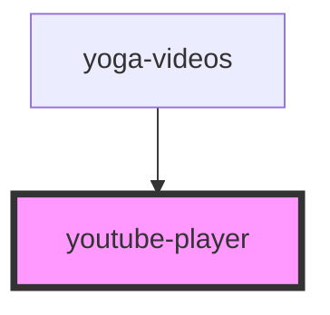

<!-- Auto Generated Below -->

## Properties

| Property  | Attribute  | Description | Type     | Default     |
| --------- | ---------- | ----------- | -------- | ----------- |
| `height`  | `height`   |             | `string` | `undefined` |
| `videoId` | `video-id` |             | `string` | `undefined` |
| `width`   | `width`    |             | `string` | `undefined` |

## Events

| Event         | Description | Type               |
| ------------- | ----------- | ------------------ |
| `ready`       |             | `CustomEvent<any>` |
| `stateChange` |             | `CustomEvent<any>` |

## Methods

### `pause() => Promise<void>`

#### Returns

Type: `Promise<void>`

### `play(video: string) => Promise<void>`

#### Parameters

| Name    | Type     | Description |
| ------- | -------- | ----------- |
| `video` | `string` |             |

#### Returns

Type: `Promise<void>`

### `stop() => Promise<void>`

#### Returns

Type: `Promise<void>`

## Dependencies

### Used by

 - [yoga-videos](../../yoga-videos)

### Graph

----------------------------------------------

*Built with ❤️ by Workern*
